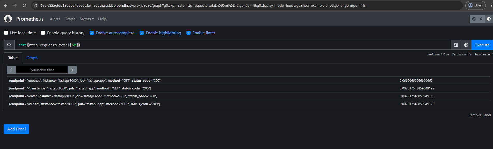
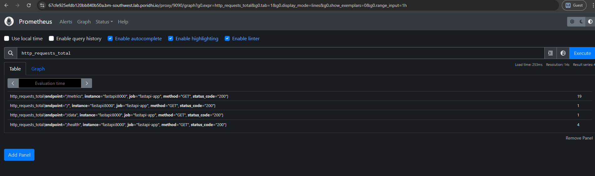
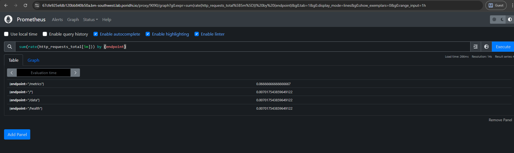
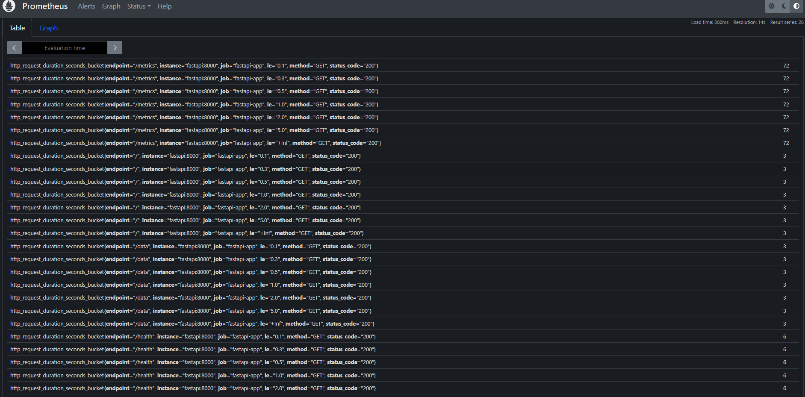
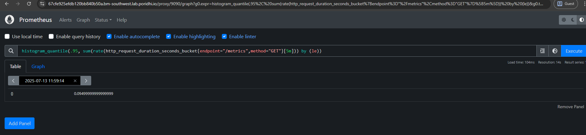

To run the project:
    docker-compose up --build

To check metrics 
### HTTP Application Metrics: 

- **Request Volume Metrics**

    1. `http_requests_total`
    

    2. `http_requests_total{endpoint="/metrics",method="GET"}`
    

    3. Global request rate: `rate(http_requests_total[5m])`
    

    4. Per-endpoint request rates:  `sum(rate(http_requests_total[5m])) by (endpoint)`
    

- **Request Performance Metrics**
    1. Histogram of request durations: `http_request_duration_seconds_bucket`
    

    2. 95th percentile latency:
    