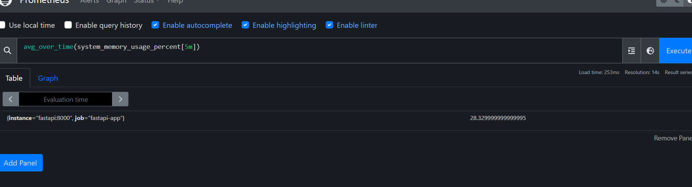
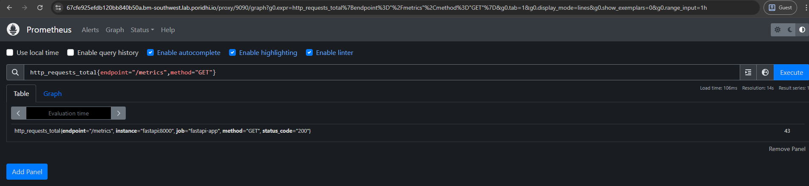

clone the github repo: 
   git clone https://github.com/Nabinchowdhury/fastapi-metrics-app.git

To run the project:
    cd fastapi-metrics-app
    docker-compose up --build

prometheus pprt : 9090
fast-api-app port: 8000

To check metrics 

### System Metrics Implementation
- **CPU Metrics**
  1. `process_cpu_seconds_total`: Total CPU time consumed by the process
  
  2. CPU usage rate calculation: `rate(process_cpu_seconds_total[5m])`
  
  3. CPU utilization percentage tracking: `avg_over_time(system_cpu_usage_percent[5m])`
  

  **Memory Metrics**
  1. `process_resident_memory_bytes`: Physical memory currently used
  
  2. `process_virtual_memory_bytes`: Virtual memory allocated
  
  3. Memory usage trends and alerting thresholds
    `system_memory_usage_percent`
    

    `avg_over_time(system_memory_usage_percent[5m])`
    

**Additional System Metrics**
  1. Process start time and uptime
    `process_start_time_seconds`
    
    `time() - process_start_time_seconds`
    

  - File descriptor usage
  - Garbage collection statistics
  - Thread count monitoring

### HTTP Application Metrics: 

- **Request Volume Metrics**

    1. `http_requests_total`
    

    2. `http_requests_total{endpoint="/metrics",method="GET"}`
    

    3. Global request rate: `rate(http_requests_total[5m])`
    

    4. Per-endpoint request rates:  `sum(rate(http_requests_total[5m])) by (endpoint)`
    

- **Request Performance Metrics**
    1. Histogram of request durations: `http_request_duration_seconds_bucket`
    

    2. 95th percentile latency: `histogram_quantile(0.95, sum(rate(http_request_duration_seconds_bucket{endpoint="/metrics",method="GET"}[5m])) by (le))`
    

    3. Request size Histogram `http_request_size_bytes_bucket`
    

    4. Response size Histogram `http_response_size_bytes_bucket`
    